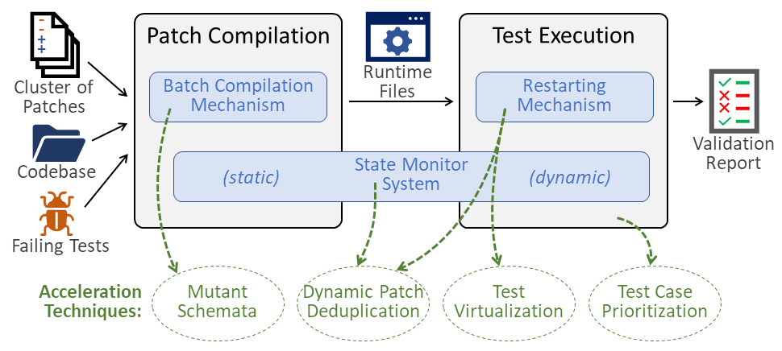
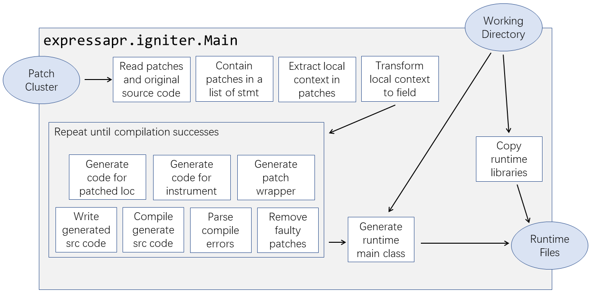
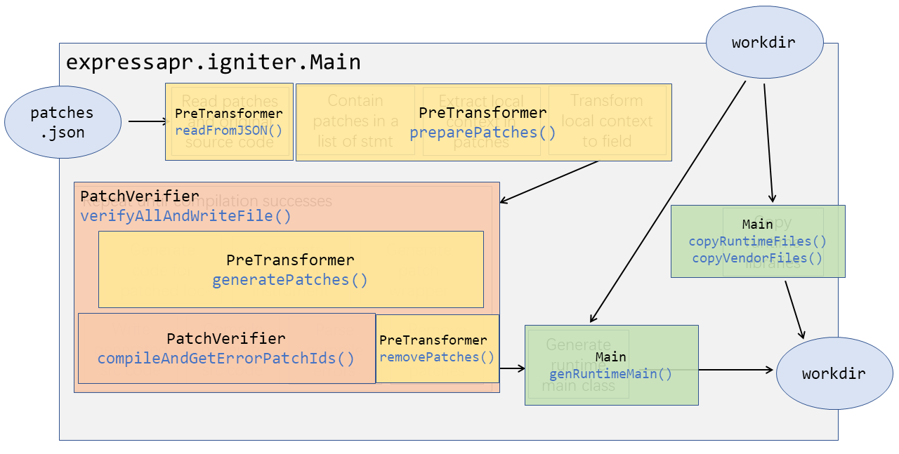
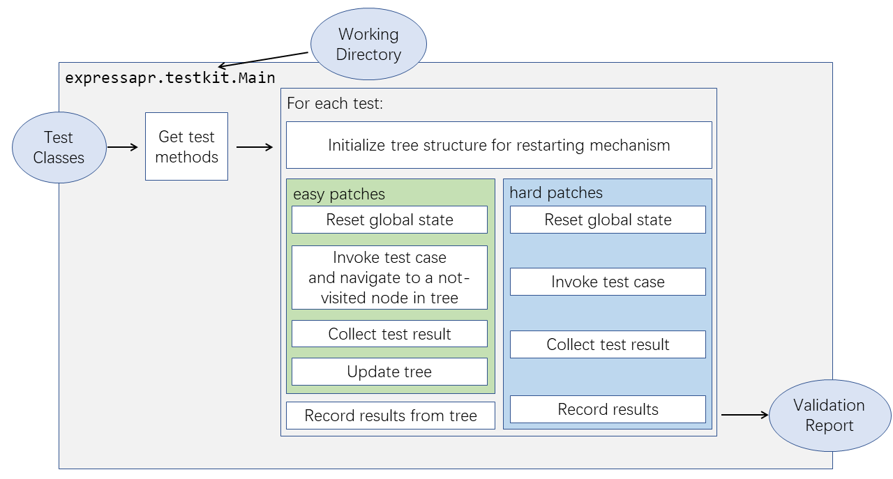
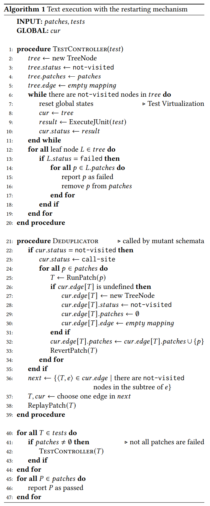

# Design and Structure of ExpressAPR Implementation

Generally ExpressAPR can be seen as two step: **patch compilation** step and **test execution** step. The former step modifies the codebase and injects necessary runtime files to be executed in the latter step. 

-----

The patch compilation step is in the `expressapr.igniter` package. The structure is described below:

Or, if you like to know the class and method name for each part:

-----

The test execution step is in the `expressapr.testkit` package (that will be injected into the codebase by patch compilation step). The structure is described below:

The pseudocode of this step is described below:

